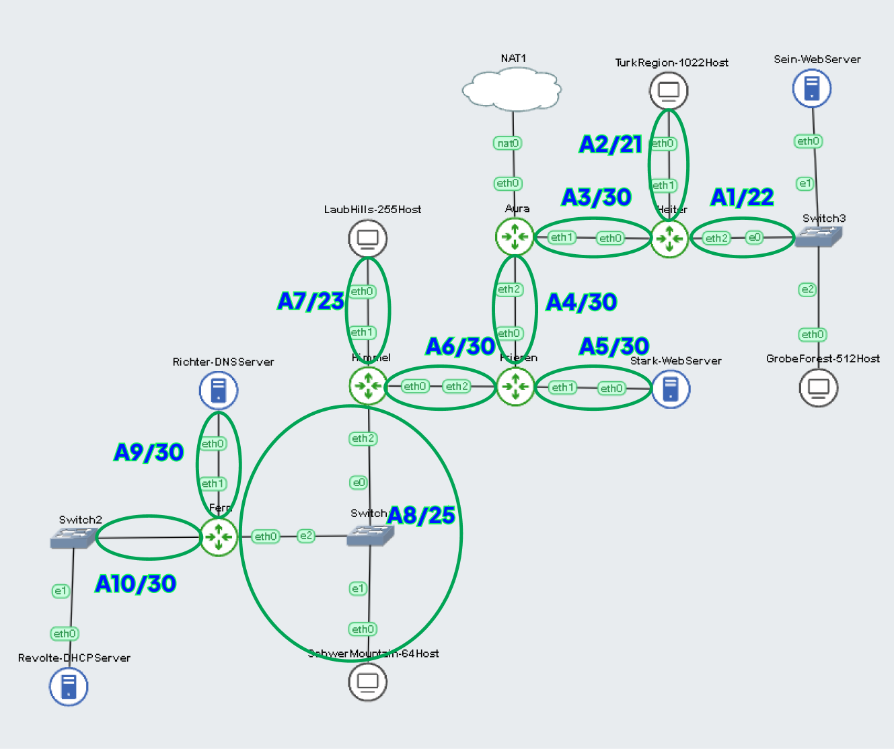
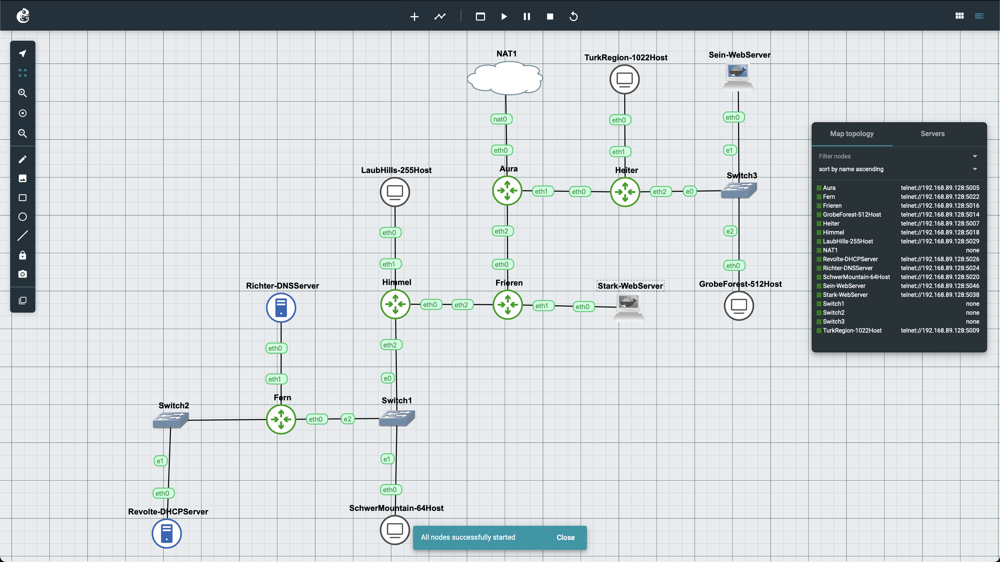
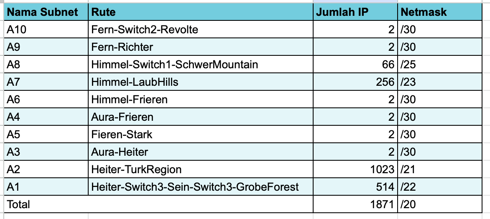
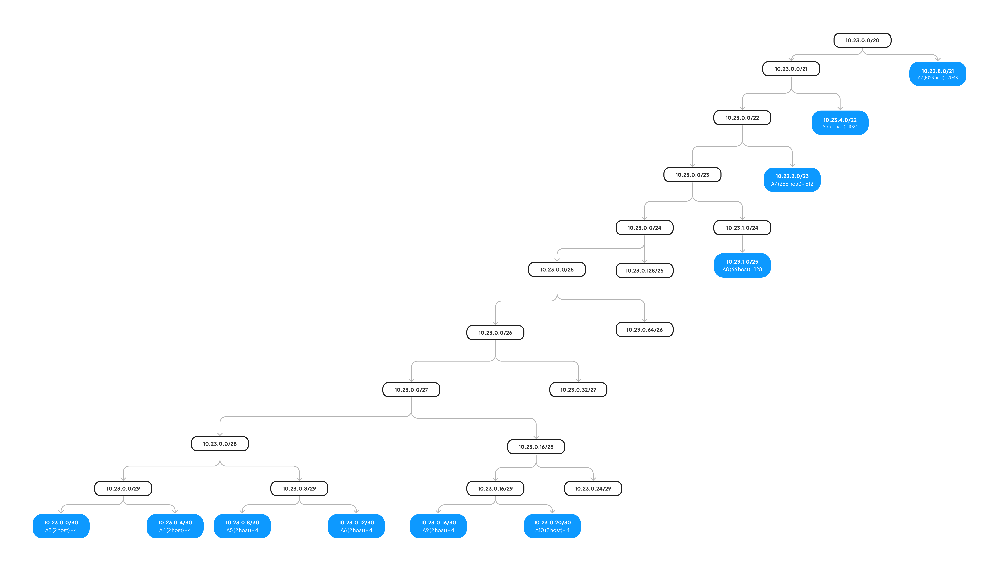
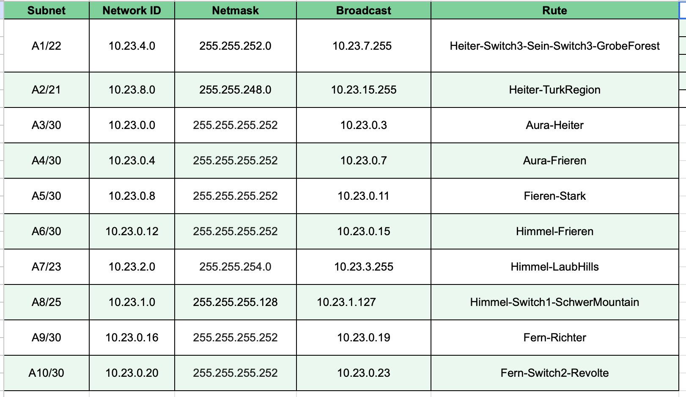

# Praktikum Modul 5 Jaringan Komputer

Perkenalkan kami dari kelas `Jaringan Komputer D Kelompok D03`, dengan anggota sebagai berikut:

## Author

| Nama                   | NRP        | Github                          |
| ---------------------- | ---------- | ------------------------------- |
| Alfan Lukeyan Rizki    | 5025211046 | https://github.com/AlfanLukeyan |
| Dimas Prihady Setyawan | 5025211184 | https://github.com/yaboidimsum  |

# Laporan Resmi Praktikum Modul 5

Pada kesempatan kali ini kami akan membahas mengenai soal praktikum modul 5. Soal praktikum modul 5 memuat konsep mengenai

- `VLSM` menggunakan `GNS 3`
- `Firewall` menggunakan `iptables`

## Daftar Isi

- [Laporan Resmi](#laporan-resmi)
- [Daftar Isi](#daftar-isi)
  - [Topologi VLSM](#topologi-vlsm)
  - [Topologi GNS3](#topologi-gns3)
  - [Prefix IP](#prefix-ip)
  - [Rute](#rute)
- [Persiapan](#persiapan)
  - [Tree](#tree)
  - [Pembagian IP](#pembagian-ip)
  - [Subnetting](#subnetting)
  - [Routing](#routing)
- [Konfigurasi](#konfigurasi)
  - [DNS Server](#dns-server)
  - [DHCP Server](#dhcp-server)
  - [DHCP Relay](#dhcp-relay)
  - [Web Server](#web-server)
  - [Client](#client)
- [Soal Praktikum](#soal-1)
  - [Soal-1](#soal-1)
  - [Soal-2](#soal-2)
  - [Soal-3](#soal-3)
  - [Soal-4](#soal-4)
  - [Soal-5](#soal-5)
  - [Soal-6](#soal-6)
  - [Soal-7](#soal-7)
  - [Soal-8](#soal-8)
  - [Soal-9](#soal-9)
  - [Soal-10](#soal-10)


## Topologi VLSM



## Topologi GNS3



## Prefix IP

Prefix IP yang dimiliki oleh kelompok D03 adalah `10.23.x.x`

## Rute

Berikut adalah Rute yang telah kami buat dari hasil [Topologi VLSM](#topologi-vlsm) sebagai berikut


## Persiapan

### Tree

Tree yang kami buat didapatkan dari hasil pengelompokkan [Topologi VLSM](#topologi-vlsm) sebagai berikut



### Pembagian IP

Berikut adalah pembagian IP yang telah kami dapatkan dari hasil [Tree](#tree) tersebut



### Subnetting

Berikut merupakan subneeting yang telah kami sesuaikan dengan `IP` yang telah didapatkan.

#### Aura

```
auto eth0
iface eth0 inet dhcp

# Aura-Heiter
auto eth1
iface eth1 inet static
	address 10.23.0.1
	netmask 255.255.255.252

# Aura-Frieren
auto eth2
iface eth2 inet static
	address 10.23.0.5
	netmask 255.255.255.252

```

#### Heiter

```
#Heiter-Aura
auto eth0
iface eth0 inet static
	address 10.23.0.2
	netmask 255.255.255.252
	gateway 10.23.0.1

#Heiter-TurkRegion
auto eth1
iface eth1 inet static
	address 10.23.8.1
	netmask 255.255.248.0

#Heiter-Sein-GrobeForest
auto eth2
iface eth2 inet static
	address 10.23.4.1
	netmask 255.255.252.0

```

#### Frieren

```
#Frieren-Aura
auto eth0
iface eth0 inet static
	address 10.23.0.6
	netmask 255.255.255.252
	gateway 10.23.0.5

#Frieren-Stark
auto eth1
iface eth1 inet static
	address 10.23.0.9
	netmask 255.255.255.252

#Frieren-Himmel
auto eth2
iface eth2 inet static
	address 10.23.0.13
	netmask 255.255.255.252
```

#### Himmel

```
#Himmel-Frieren
auto eth0
iface eth0 inet static
	address 10.23.0.14
	netmask 255.255.255.252
	gateway 10.23.0.13

#Himmel-LaubHills
auto eth1
iface eth1 inet static
	address 10.23.2.1
	netmask 255.255.254.0

#Himmel-SchwerMountain-Fern
auto eth2
iface eth2 inet static
	address 10.23.1.1
	netmask 255.255.255.128
```

#### Fern

```
#Fern-Himmel
auto eth0
iface eth0 inet static
	address 10.23.1.3
	netmask 255.255.255.128
	gateway 10.23.1.1

#Fern-Richter
auto eth1
iface eth1 inet static
	address 10.23.0.17
	netmask 255.255.255.252

#Fern-Revolte
auto eth2
iface eth2 inet static
	address 10.23.0.21
	netmask 255.255.255.252
```

#### Revolte

```
auto eth0
iface eth0 inet static
	address 10.23.0.22
	netmask 255.255.255.252
	gateway 10.23.0.21
```

#### Richter

```
auto eth0
iface eth0 inet static
	address 10.23.0.18
	netmask 255.255.255.252
	gateway 10.23.0.17
```

#### Stark

```
auto eth0
iface eth0 inet static
	address 10.23.0.10
	netmask 255.255.255.252
	gateway 10.23.0.9
```

#### Sein

```
auto eth0
iface eth0 inet static
	address 10.23.4.2
	netmask 255.255.252.0
	gateway 10.23.4.1
```

#### Client

```
auto eth0
iface eth0 inet dhcp
```

### Routing

Setelah melakukan subnetting pada setiap `node`. Sekarang kami akan beralih pada setup `routing` sebagai berikut

#### Aura

```
up route add -net 10.23.4.0 netmask 255.255.252.0 gw 10.23.0.2
up route add -net 10.23.8.0 netmask 255.255.248.0 gw 10.23.0.2
up route add -net 10.23.0.8 netmask 255.255.255.252 gw 10.23.0.6
up route add -net 10.23.0.12 netmask 255.255.255.252 gw 10.23.0.6
up route add -net 10.23.2.0 netmask 255.255.254.0 gw 10.23.0.6
up route add -net 10.23.1.0 netmask 255.255.255.128 gw 10.23.0.6
up route add -net 10.23.0.16 netmask 255.255.255.252 gw 10.23.0.6
up route add -net 10.23.0.20 netmask 255.255.255.252 gw 10.23.0.6
```

#### Heiter

```
up route add -net 0.0.0.0 netmask 0.0.0.0 gw 10.23.0.1
```

#### Frieren

```
up route add -net 0.0.0.0 netmask 0.0.0.0 gw 10.23.0.5
up route add -net 10.23.2.0 netmask 255.255.254.0 gw 10.23.0.14
up route add -net 10.23.1.0 netmask 255.255.255.128 gw 10.23.0.14
up route add -net 10.23.0.16 netmask 255.255.255.252 gw 10.23.0.14
up route add -net 10.23.0.20 netmask 255.255.255.252 gw 10.23.0.14
```

#### Himmel

```
up route add -net 0.0.0.0 netmask 0.0.0.0 gw 10.23.0.13
up route add -net 10.23.0.16 netmask 255.255.255.252 gw 10.23.1.3
up route add -net 10.23.0.20 netmask 255.255.255.252 gw 10.23.1.3
```

#### Fern

```
up route add -net 0.0.0.0 netmask 0.0.0.0 gw 10.23.1.1
```

## Konfigurasi

Sebelum melakukan konfigurasi terhadap masing-masing `router` yang telah ditentukan, disini kita harus menjalankan perintah berikut pada router `Aura`

```
iptables -t nat -A POSTROUTING -o eth0 -j MASQUERADE -s 10.23.0.0/16
```

Setelah itu, jangan lupa untuk tiap node agar di berikan `nameserver 192.168.122.1` agar dapat terhubung dengan internet

### DNS Server

Disini yang bertindak sebagai `DNS Server` adalah router `Richter` dan akan dilakukan konfigurasi sebagai berikut dengan bantuan `bash` nantinya

```sh
# Richter
echo 'nameserver 192.168.122.1' >/etc/resolv.conf

apt-get update
apt-get install bind9 -y
cp ~/named.conf.options /etc/bind/

echo 'options {
        directory "/var/cache/bind";

        forwarders {
                192.168.122.1;
        };

        allow-query{any;};
        auth-nxdomain no;
        listen-on-v6 { any; };
};' > /etc/bind/named.conf.options

service bind9 restart
```

### DHCP Server

Setelah berhasil melakukan setup untuk `DNS Server`. Sekarang kami berpindah untuk melakukan beberapa konfigurasi yang dibutuhkan pada `DHCP Server` sebagai berikut

```sh
echo 'nameserver 192.168.122.1' > /etc/resolv.conf

apt-get update
apt install isc-dhcp-server -y
echo '
INTERFACESv4="eth0"
INTERFACESv6=
' > /etc/default/isc-dhcp-server

echo '
#A1
subnet 10.23.4.0 netmask 255.255.252.0 {
    range 10.23.4.2 10.23.7.254;
    option routers 10.23.4.1;
    option broadcast-address 10.23.7.255;
    option domain-name-servers 10.23.0.18;
    default-lease-time 180;
    max-lease-time 5760;
}

#A2
subnet 10.23.8.0 netmask 255.255.248.0 {
    range 10.23.8.2 10.23.15.254;
    option routers 10.23.8.1;
    option broadcast-address 10.23.15.255;
    option domain-name-servers 10.23.0.18;
    default-lease-time 180;
    max-lease-time 5760;
}

#A3
subnet 10.23.0.0 netmask 255.255.255.252 {
}

#A4
subnet 10.23.0.4 netmask 255.255.255.252 {

}

#A5
subnet 10.23.0.8 netmask 255.255.255.252 {
}

#A6
subnet 10.23.0.12 netmask 255.255.255.252 {
}

#A7
subnet 10.23.2.0 netmask 255.255.254.0 {
    range 10.23.2.2 10.23.3.254;
    option routers 10.23.2.1;
    option broadcast-address 10.23.3.255;
    option domain-name-servers 10.23.0.18;
    default-lease-time 180;
    max-lease-time 5760;
}

#A8
subnet 10.23.1.0 netmask 255.255.255.128 {
    range 10.23.1.2 10.23.1.126;
    option routers 10.23.1.1;
    option broadcast-address 10.23.1.127;
    option domain-name-servers 10.23.0.18;
    default-lease-time 180;
    max-lease-time 5760;
}

#A9
subnet 10.23.0.16 netmask 255.255.255.252 {
}

#A10
subnet 10.23.0.20 netmask 255.255.255.252 {
}
' > /etc/dhcp/dhcpd.conf

rm /run/dhcpd.pid
service isc-dhcp-server restart
```

Disini terlihat bahwa `kami` juga melakukan setup pada masing-masing `subnet` yang nantinya akan digunakan oleh masing-masing client `dhcp client`.

### DHCP Relay

Untuk `DHCP Relay` kita perlu melakukan pertimbangan terlebih dahulu, karena konsep pada `DHCP Relay` adalah _DHCP Relay bertindak sebagai perantara antara klien dan server DHCP. Ketika klien mengirim permintaan DHCP, relay menangkap pesan tersebut dan mengirimkannya ke server DHCP melalui unicast (tidak broadcast)._

Sehingga disini kita perlu untuk melakukan `konfigurasi` pada router yang berdekatan dengan `client` yang akan diberikan `IP` oleh DHCP. Sehingga disini kami memberikan `DHCP Relay` pada router `Heiter` dan `Himmel`. Karena `Heiter` berdekatan dengan client **TurkRegion** dan **GrobeForest**, sedangkan `Himmel` berdekatan dengan **LaubHills** dan **SchwerMountain**. Konfigurasinya adalah sebagai berikut

```sh
echo 'nameserver 192.168.122.1' > /etc/resolv.conf

apt-get update
apt-get install isc-dhcp-relay -y
service isc-dhcp-relay start

echo '
SERVERS="10.23.0.22"
INTERFACES="eth0 eth1 eth2"
OPTIONS=
' > /etc/default/isc-dhcp-relay

echo '
net.ipv4.ip_forward=1
' > /etc/sysctl.conf

service isc-dhcp-relay restart
```

Lalu jangan lupa untuk melakukan uncomment `net.ipv4.ip_forward=1` pada `/etc/sysctl.conf`

### Web Server

Pada `web server` kami akan menggunakan `apache2` dan akan dikonfigurasikan untuk router `Sein` dan `Stark` sebagai berikut

```sh
echo 'nameserver 192.168.122.1' > /etc/resolv.conf

apt update
apt install netcat -y
apt install apache2 -y
service apache2 start

echo '# If you just change the port or add more ports here, you will likely also
# have to change the VirtualHost statement in
# /etc/apache2/sites-enabled/000-default.conf

Listen 80
Listen 443

<IfModule ssl_module>
        Listen 443
</IfModule>

<IfModule mod_gnutls.c>
        Listen 443
</IfModule>

# vim: syntax=apache ts=4 sw=4 sts=4 sr noet' > /etc/apache2/ports.conf
```

Lalu pada `/var/www/html/index.html` di masing-masing node `Sein` ataupun `Start` tambahkan berikut:

```
echo '# Sein | Stark
Sein | Stark nih' > /var/www/html/index.html
```

### Client

Untuk masing-masing client, kita hanya perlu install `lynx` karena akan digunakan sebagai testing nantinya

```sh
apt update
apt install netcat -y
apt install lynx -y
```

# Jawaban

Setelah berhasil melakukan [Konfigurasi](#konfigurasi) seperti diatas, sekarang jangan lupa untuk melakukan `restart (stop lalu start lagi)` pada router `Aura` karena akan digunakan pada [Soal 1](#soal-1)

## Soal-1

> Agar topologi yang kalian buat dapat mengakses keluar, kalian diminta untuk mengkonfigurasi Aura menggunakan iptables, tetapi tidak ingin menggunakan MASQUERADE.

### Script

Ada 2 opsi untuk mengerjakan `soal` ini. Yang pertama dari awal langsung dilakukan setup tanpa `MASQUERADE` yang kedua bisa langsung tanpa `MASQUERADE`. Jika memilih opsi yang pertama, maka anda harus melakukan `restart` pada node `Aura` memastikan bahwa `iptables` sebelumnya sudah tidak ada. Jika menggunakan cara yang kedua maka tidak perlu untuk melakukan `restart` pada node `Aura`.

Dengan menggunakan cara yang kedua, dilakukan konfigurasi agar topologi dapat mengakses internet keluar (NAT). Tanpa MASQUERADE, konfigurasi dilakukan dengan memanfaatkan scripting sederhana, yaitu dengan menggunakan `SNAT --to-source` yang mengarah pada NID dari router yang berhubungan dengan NAT, yaitu **10.23.0.0/20**. Dengan kata lain, `IP` tesebut adalah IP terluar / terjauh yang mencakup seluruh `IP` yang kita peroleh sebelumnya.

Namun, sebelumnya perlu definisikan `interface` mana yang terkoneksi dengan NAT. Pada kasus ini adalah `Aura`, interface yang berhubungan adalah `eth0`. Definisi tersebut dapat dimasukkan ke dalam sebuah variabel. Di sini, digunakan variabel bernama `IPETH0`.

```sh
# No 1 (Aura)
IPETH0="$(ip -br a | grep eth0 | awk '{print $NF}' | cut -d'/' -f1)"
iptables -t nat -A POSTROUTING -o eth0 -j SNAT --to-source "$IPETH0" -s 10.23.0.0/20
```

### Testing


## Soal-2

> Kalian diminta untuk melakukan drop semua TCP dan UDP kecuali port 8080 pada TCP.

### Script

Penyelesaian
- GrobeForest


```sh
# Bersihkan semua aturan yang ada jika diperlukan
iptables -F
# Izinkan koneksi yang masuk pada port 8080 TCP
iptables -A INPUT -p tcp --dport 8080 -j ACCEPT

# Jatuhkan semua koneksi TCP yang tidak menuju ke port 8080
iptables -A INPUT -p tcp ! --dport 8080 -j DROP

# Jatuhkan semua koneksi UDP
iptables -A INPUT -p udp -j DROP
```

**Penjelasan**

Script iptables yang Anda bagikan memiliki tujuan untuk mengkonfigurasi firewall pada sistem Linux. Berikut adalah penjelasan poin-poin dalam script tersebut:

1. **Bersihkan semua aturan yang ada jika diperlukan:**
   ```bash
   iptables -F
   ```
   - Perintah ini menghapus semua aturan yang telah dikonfigurasi sebelumnya. Ini memastikan bahwa kita memulai dengan tabel iptables yang kosong sebelum menambahkan aturan-aturan baru.

2. **Izinkan koneksi yang masuk pada port 8080 TCP:**
   ```bash
   iptables -A INPUT -p tcp --dport 8080 -j ACCEPT
   ```
   - Ini menambahkan aturan pada tabel INPUT untuk mengizinkan koneksi TCP yang masuk (INPUT) pada port 8080.

3. **Jatuhkan semua koneksi TCP yang tidak menuju ke port 8080:**
   ```bash
   iptables -A INPUT -p tcp ! --dport 8080 -j DROP
   ```
   - Aturan ini menolak (DROP) semua koneksi TCP yang tidak menuju ke port 8080. Dengan kata lain, hanya koneksi TCP yang menuju ke port 8080 yang diizinkan.

4. **Jatuhkan semua koneksi UDP:**
   ```bash
   iptables -A INPUT -p udp -j DROP
   ```
   - Ini menolak (DROP) semua koneksi UDP yang masuk. Dengan aturan ini, tidak ada koneksi UDP yang diizinkan.

Jadi, inti dari script ini adalah memungkinkan koneksi TCP masuk hanya pada port 8080 dan menolak semua koneksi UDP serta koneksi TCP yang tidak menuju ke port 8080. Ini bisa digunakan sebagai dasar untuk mengonfigurasi firewall pada server untuk skenario tertentu di mana kita hanya ingin memungkinkan koneksi tertentu ke dalam sistem.

### Testing

- Koneksi ke port 8080 TCP diterima:

.png)

.png)

- Koneksi ke port selain 8080 TCP ditolak:

.png)

.png)

- Koneksi ke port UDP ditolak:

.png)

.png)

## Soal-3

 Kepala Suku North Area meminta kalian untuk membatasi DHCP dan DNS Server hanya dapat dilakukan ping oleh maksimal 3 device secara bersamaan, selebihnya akan di drop.

### Script

- Revolte (DNS Server)

```sh
iptables -A INPUT -m state --state ESTABLISHED,RELATED -j ACCEPT
iptables -A INPUT -p icmp -m connlimit --connlimit-above 3 --connlimit-mask 0 -j DROP
```

- Ricther (DHCP Server)

```sh
iptables -A INPUT -m state --state ESTABLISHED,RELATED -j ACCEPT
iptables -A INPUT -p icmp -m connlimit --connlimit-above 3 --connlimit-mask 0 -j DROP
```

**Penjelasan**
1. **Izinkan koneksi yang sudah terjalin (ESTABLISHED,RELATED):**
   ```bash
   iptables -A INPUT -m state --state ESTABLISHED,RELATED -j ACCEPT
   ```
   - Aturan ini memungkinkan (ACCEPT) paket yang merupakan bagian dari koneksi yang sudah terjalin atau terkait dengan koneksi yang sudah ada. Misalnya, ini penting untuk memastikan respon dari koneksi yang sudah diinisiasi dari dalam sistem.

2. **Batasi jumlah koneksi ICMP yang diizinkan:**
   ```bash
   iptables -A INPUT -p icmp -m connlimit --connlimit-above 3 --connlimit-mask 0 -j DROP
   ```
   - Aturan ini menetapkan batasan pada jumlah koneksi ICMP (ping) yang diizinkan. Jika jumlah koneksi ICMP melebihi 3, aturan ini akan menolak (DROP) koneksi tersebut. Parameter `--connlimit-above 3` menunjukkan bahwa koneksi di atas 3 akan ditolak, dan `--connlimit-mask 0` menunjukkan bahwa batasan tersebut diterapkan pada setiap alamat IP yang berbeda.

Dengan dua aturan tambahan ini, firewall akan mengizinkan koneksi yang sudah terjalin (misalnya, respon dari permintaan sebelumnya) dan membatasi jumlah koneksi ICMP yang diizinkan agar melindungi dari potensi serangan DoS (Denial of Service) yang melibatkan serangan ICMP.

### Testing

- Ping ke DNS Server (Richter) dari 4 client secara bersamaan:

.png)

- Ping ke DHCP Server (Revolte) dari 4 client secara bersamaan:

.png)

## Soal-4

> Lakukan pembatasan sehingga koneksi SSH pada Web Server hanya dapat dilakukan oleh masyarakat yang berada pada GrobeForest.

### Script

```sh
iptables -A INPUT -p tcp --dport 22 -s 10.23.4.0/22 -j ACCEPT
iptables -A INPUT -p tcp --dport 22 -j DROP
```

**Penjelasan**

Dua baris tambahan dalam script iptables tersebut berkaitan dengan pengaturan akses untuk koneksi SSH (Secure Shell) ke port 22. Berikut adalah penjelasan dari kedua baris tersebut:

1. **Izinkan koneksi SSH dari jaringan 10.23.4.0/22:**
   ```bash
   iptables -A INPUT -p tcp --dport 22 -s 10.23.4.0/22 -j ACCEPT
   ```
   - Aturan ini memungkinkan (ACCEPT) koneksi TCP yang menuju ke port 22 (port default untuk SSH) hanya dari jaringan dengan rentang IP 10.23.4.0/22. Ini adalah cara untuk membatasi akses SSH ke server hanya dari jaringan tertentu.

2. **Jatuhkan semua koneksi SSH yang tidak memenuhi aturan sebelumnya:**
   ```bash
   iptables -A INPUT -p tcp --dport 22 -j DROP
   ```
   - Aturan ini menolak (DROP) semua koneksi TCP yang menuju ke port 22 (SSH) dan tidak memenuhi aturan sebelumnya. Dengan kata lain, jika koneksi SSH berasal dari luar jaringan 10.23.4.0/22, koneksi tersebut akan ditolak.

Dengan kombinasi dari kedua aturan tersebut, firewall akan mengizinkan koneksi SSH hanya dari jaringan dengan rentang IP 10.23.4.0/22 dan menolak semua koneksi SSH dari luar rentang IP tersebut. Ini adalah contoh implementasi kontrol akses yang ketat terhadap layanan SSH untuk meningkatkan keamanan sistem.

### Testing

**GrobeForest dan LaubHills**


## Soal-5

> Selain itu, akses menuju WebServer hanya diperbolehkan saat jam kerja yaitu Senin-Jumat pada pukul 08.00-16.00.

### Script

```sh
iptables -A INPUT -p tcp --dport 22 -m time --weekdays Mon,Tue,Wed,Thu,Fri --timestart 08:00 --timestop 16:00 -s 10.23.4.0/22 -j ACCEPT
```

**Penjelasan**

Berikut adalah penjelasan poin-poin dari aturan iptables yang baru ditambahkan:

1. **Izinkan koneksi SSH (port 22):**
   ```bash
   iptables -A INPUT -p tcp --dport 22 -s 10.23.4.0/22 -j ACCEPT
   ```
   - Aturan ini memungkinkan (ACCEPT) koneksi TCP yang menuju ke port 22 (SSH) hanya dari jaringan dengan rentang IP 10.23.4.0/22. Ini adalah cara untuk membatasi akses SSH ke server hanya dari jaringan tertentu.

2. **Tambahkan kontrol waktu untuk aturan koneksi SSH:**
   ```bash
   iptables -A INPUT -p tcp --dport 22 -m time --weekdays Mon,Tue,Wed,Thu,Fri --timestart 08:00 --timestop 16:00 -s 10.23.4.0/22 -j ACCEPT
   ```
   - Aturan ini menambahkan kontrol waktu, yang berarti koneksi SSH hanya diizinkan pada hari kerja (Senin hingga Jumat), antara pukul 08:00 dan 16:00. Selain itu, koneksi ini hanya diizinkan dari jaringan dengan rentang IP 10.23.4.0/22.

3. **Penolakan untuk koneksi SSH di luar kontrol waktu dan jaringan:**
   ```bash
   iptables -A INPUT -p tcp --dport 22 -j DROP
   ```
   - Aturan ini menolak (DROP) semua koneksi TCP yang menuju ke port 22 (SSH) dan tidak memenuhi aturan sebelumnya. Dengan kata lain, jika koneksi SSH berasal dari luar rentang waktu atau jaringan yang diizinkan, koneksi tersebut akan ditolak.

Dengan kombinasi dari ketiga aturan ini, firewall akan membatasi akses SSH ke waktu tertentu (hari kerja, pukul 08:00 - 16:00) dan hanya dari jaringan yang diizinkan (10.23.4.0/22). Hal ini membantu meningkatkan keamanan dengan mengontrol kapan dan dari mana akses SSH diizinkan.

### Testing

**Sukses**
.png)

**Gagal**
.png)

## Soal-6

> Lalu, karena ternyata terdapat beberapa waktu di mana network administrator dari WebServer tidak bisa stand by, sehingga perlu ditambahkan rule bahwa akses pada hari Senin - Kamis pada jam 12.00 - 13.00 dilarang (istirahat maksi cuy) dan akses di hari Jumat pada jam 11.00 - 13.00 juga dilarang (maklum, Jumatan rek).

### Script

```sh
iptables -A INPUT -p tcp --dport 22 -m time --weekdays Mon,Tue,Wed,Thu --timestart 12:00 --timestop 13:00 -j DROP
iptables -A INPUT -p tcp --dport 22 -m time --weekdays Fri --timestart 11:00 --timestop 13:00 -j DROP
```

**Penjelasan**

Berikut adalah penjelasan poin-poin untuk dua aturan iptables yang baru ditambahkan:

1. **Menolak koneksi SSH pada hari Senin hingga Kamis antara pukul 12:00 dan 13:00:**
   ```bash
   iptables -A INPUT -p tcp --dport 22 -m time --weekdays Mon,Tue,Wed,Thu --timestart 12:00 --timestop 13:00 -j DROP
   ```
   - Aturan ini menolak (DROP) koneksi TCP yang menuju ke port 22 (SSH) pada hari Senin hingga Kamis antara pukul 12:00 dan 13:00.

2. **Menolak koneksi SSH pada hari Jumat antara pukul 11:00 dan 13:00:**
   ```bash
   iptables -A INPUT -p tcp --dport 22 -m time --weekdays Fri --timestart 11:00 --timestop 13:00 -j DROP
   ```
   - Aturan ini menolak (DROP) koneksi TCP yang menuju ke port 22 (SSH) pada hari Jumat antara pukul 11:00 dan 13:00.

Dengan menambahkan dua aturan ini, pengaturan waktu untuk akses SSH semakin dikonfigurasi secara detail. Koneksi SSH sekarang akan ditolak pada waktu yang lebih spesifik, yaitu pada hari Senin hingga Kamis antara pukul 12:00 dan 13:00, serta pada hari Jumat antara pukul 11:00 dan 13:00. Ini adalah contoh lain dari implementasi kontrol waktu pada firewall untuk meningkatkan keamanan sistem.

### Testing

Weekdays Mon,Tue,Wed,Thu
**Sukses**

.png)

**Gagal**

.png)

Weekdays Friday
**Sukses**

.png)

**Gagal**

.png)

## Soal-7

> Karena terdapat 2 WebServer, kalian diminta agar setiap client yang mengakses Sein dengan Port 80 akan didistribusikan secara bergantian pada Sein dan Stark secara berurutan dan request dari client yang mengakses Stark dengan port 443 akan didistribusikan secara bergantian pada Sein dan Stark secara berurutan.

### Script

```sh
iptables -t nat -F

# Akses ke Sein port 80
iptables -A PREROUTING -t nat -p tcp --dport 80 -d 10.23.4.2 -m statistic --mode nth --every 2 --packet 0 -j DNAT --to-destination 10.23.4.2
iptables -A PREROUTING -t nat -p tcp --dport 80 -d 10.23.4.2 -j DNAT --to-destination 10.23.0.10

# Akses ke Stark port 443

iptables -A PREROUTING -t nat -p tcp --dport 443 -d 10.23.0.10 -m statistic --mode nth --every 2 --packet 0 -j DNAT --to-destination 10.23.4.2
iptables -A PREROUTING -t nat -p tcp --dport 443 -d 10.23.0.10 -j DNAT --to-destination 10.23.0.10
```

**Penjelasan**

Script iptables yang Anda berikan digunakan untuk melakukan distribusi bergantian (round-robin) untuk koneksi ke dua server web (Sein dan Stark) pada port 80 dan 443. Berikut adalah penjelasan poin-poin dalam script tersebut:

1. **Hapus semua aturan di tabel nat:**
   ```bash
   iptables -t nat -F
   ```
   - Ini membersihkan semua aturan yang ada dalam tabel nat, memastikan kita memulai dengan tabel yang kosong sebelum menambahkan aturan-aturan baru.

2. **Distribusi koneksi ke Sein pada port 80 secara bergantian:**
   ```bash
   # Akses ke Sein port 80
   iptables -A PREROUTING -t nat -p tcp --dport 80 -d 10.23.4.2 -m statistic --mode nth --every 2 --packet 0 -j DNAT --to-destination 10.23.4.2
   iptables -A PREROUTING -t nat -p tcp --dport 80 -d 10.23.4.2 -j DNAT --to-destination 10.23.0.10
   ```
   - Aturan ini menggunakan modul statistik untuk mendistribusikan koneksi secara bergantian antara dua server (10.23.4.2 dan 10.23.0.10) pada port 80.

3. **Distribusi koneksi ke Stark pada port 443 secara bergantian:**
   ```bash
   # Akses ke Stark port 443
   iptables -A PREROUTING -t nat -p tcp --dport 443 -d 10.23.0.10 -m statistic --mode nth --every 2 --packet 0 -j DNAT --to-destination 10.23.4.2
   iptables -A PREROUTING -t nat -p tcp --dport 443 -d 10.23.0.10 -j DNAT --to-destination 10.23.0.10
   ```
   - Aturan ini menggunakan modul statistik untuk mendistribusikan koneksi secara bergantian antara dua server (10.23.4.2 dan 10.23.0.10) pada port 443.

Dengan aturan-aturan ini, koneksi ke server web pada port 80 dan 443 akan didistribusikan secara bergantian antara Sein dan Stark sesuai dengan skenario yang dijelaskan.

### Testing

.png)

.png)

## Soal-8

> Karena berbeda koalisi politik, maka subnet dengan masyarakat yang berada pada Revolte dilarang keras mengakses WebServer hingga masa pencoblosan pemilu kepala suku 2024 berakhir. Masa pemilu (hingga pemungutan dan penghitungan suara selesai) kepala suku bersamaan dengan masa pemilu Presiden dan Wakil Presiden Indonesia 2024

Kalau gagal dimatikan lalu nyalakan webservernya lagi

### Script

```sh
# IP Subnet dari Revolte
subnet_a10="10.23.0.20/30"

mulai_pemilu=$(date -d "2023-10-19T00:00" +"%Y-%m-%dT%H:%M")
selesai_pemilu=$(date -d "2024-02-15T00:00" +"%Y-%m-%dT%H:%M")

iptables -A INPUT -p tcp -s $subnet_a10 --dport 80 -m time --datestart "$mulai_pemilu" --datestop "$selesai_pemilu" -j DROP

```

**Penjelasan**

Script iptables yang diberikan bertujuan untuk melarang akses ke WebServer (port 80) dari subnet dengan masyarakat yang berada pada subnet Revolte selama periode pemilu kepala suku 2024. Berikut adalah penjelasan poin-poin dalam script tersebut:

1. **Definisi IP Subnet Revolte:**
   ```bash
   subnet_a10="10.23.0.20/30"
   ```
   - Variabel `subnet_a10` menentukan subnet dari masyarakat yang berada pada Revolte, yaitu 10.23.0.20/30.

2. **Penetapan Waktu Pemilu:**
   ```bash
   mulai_pemilu=$(date -d "2023-10-19T00:00" +"%Y-%m-%dT%H:%M")
   selesai_pemilu=$(date -d "2024-02-15T00:00" +"%Y-%m-%dT%H:%M")
   ```
   - Variabel `mulai_pemilu` dan `selesai_pemilu` menentukan waktu awal dan akhir pemilu kepala suku 2024, yang ditetapkan dari tanggal 19 Oktober 2023 hingga tanggal 15 Februari 2024.

3. **Tambahkan Aturan iptables untuk Melarang Akses dari Subnet Revolte:**
   ```bash
   iptables -A INPUT -p tcp -s $subnet_a10 --dport 80 -m time --datestart "$mulai_pemilu" --datestop "$selesai_pemilu" -j DROP
   ```
   - Aturan ini menambahkan aturan iptables untuk menolak (DROP) semua koneksi TCP yang berasal dari subnet Revolte (10.23.0.20/30) dan menuju ke port 80 (WebServer) selama periode pemilu kepala suku 2024. Pengaturan waktu menggunakan modul waktu (`-m time`) dengan batasan waktu mulai dan berakhir yang telah ditentukan.

Dengan aturan ini, akses ke WebServer pada port 80 dari subnet Revolte akan ditolak selama masa pemilu kepala suku 2024, sesuai dengan rentang waktu yang ditetapkan.

### Testing

**Sukses**
.png)

**Gagal**
.png)

## Soal-9

> Sadar akan adanya potensial saling serang antar kubu politik, maka WebServer harus dapat secara otomatis memblokir alamat IP yang melakukan scanning port dalam jumlah banyak (maksimal 20 scan port) di dalam selang waktu 10 menit. (clue: test dengan nmap)

### Script

- Sein dan Stark (Web Server)

```sh
iptables -N portscan

iptables -A INPUT -m recent --name portscan --update --seconds 600 --hitcount 20 -j DROP
iptables -A FORWARD -m recent --name portscan --update --seconds 600 --hitcount 20 -j DROP

iptables -A INPUT -m recent --name portscan --set -j ACCEPT
iptables -A FORWARD -m recent --name portscan --set -j ACCEPT
```

**Penjelasan**

Script iptables yang diberikan bertujuan untuk mendeteksi dan memblokir serangan pemindaian port dengan menggunakan modul "recent" di iptables. Berikut adalah penjelasan poin-poin dalam script tersebut:

1. **Buat chain baru dengan nama "portscan":**
   ```bash
   iptables -N portscan
   ```
   - Ini membuat chain baru bernama "portscan" yang akan digunakan untuk menangani deteksi pemindaian port.

2. **Update hit count untuk setiap paket yang masuk atau diforward:**
   ```bash
   iptables -A INPUT -m recent --name portscan --update --seconds 600 --hitcount 20 -j DROP
   iptables -A FORWARD -m recent --name portscan --update --seconds 600 --hitcount 20 -j DROP
   ```
   - Aturan ini memeriksa apakah paket yang masuk ke INPUT atau diforward oleh FORWARD memiliki hit count lebih dari 20 dalam rentang waktu 600 detik (10 menit). Jika iya, maka paket tersebut akan ditolak (DROP).

3. **Set hit count untuk paket yang baru masuk:**
   ```bash
   iptables -A INPUT -m recent --name portscan --set -j ACCEPT
   iptables -A FORWARD -m recent --name portscan --set -j ACCEPT
   ```
   - Aturan ini mengatur hit count untuk setiap paket yang baru masuk ke INPUT atau diforward oleh FORWARD ke 0 dan mengizinkan (ACCEPT) paket tersebut untuk melewati.

Dengan konfigurasi ini, iptables akan secara otomatis memblokir alamat IP yang melakukan pemindaian port (scanning port) dalam jumlah banyak (maksimal 20 scan port) dalam selang waktu 10 menit.

### Testing

.png)

## Soal-10

> Karena kepala suku ingin tau paket apa saja yang di-drop, maka di setiap node server dan router ditambahkan logging paket yang di-drop dengan standard syslog level.

### Script

```sh
iptables -A INPUT  -j LOG --log-level debug --log-prefix 'Dropped Packet' -m limit --limit 1/second --limit-burst 10
```

**Penjelasan**

Script iptables yang diberikan menambahkan aturan untuk mencatat (log) paket yang ditolak (DROP) pada chain INPUT. Berikut adalah penjelasan poin-poin dalam script tersebut:

```bash
iptables -A INPUT  -j LOG --log-level debug --log-prefix 'Dropped Packet' -m limit --limit 1/second --limit-burst 10
```

- `iptables -A INPUT`: Menambahkan aturan pada chain INPUT, yang berarti aturan ini akan berlaku untuk paket yang ditujukan ke sistem.

- `-j LOG`: Mengarahkan paket yang memenuhi aturan ini untuk dicatat (log).

- `--log-level debug`: Menentukan tingkat log sebagai "debug". Level ini akan mencakup informasi lebih rinci dalam log.

- `--log-prefix 'Dropped Packet'`: Menentukan awalan (prefix) untuk setiap entri log yang dihasilkan, sehingga mempermudah identifikasi log yang berkaitan dengan paket yang ditolak.

- `-m limit --limit 1/second --limit-burst 10`: Menentukan pembatasan jumlah log yang dihasilkan. Dengan konfigurasi ini, setidaknya satu entri log akan dibuat per detik, dan jika jumlah log mencapai 10 dalam satu detik, log akan dibatasi untuk menghindari terlalu banyak entri log yang diciptakan.

Dengan aturan ini, setiap kali sebuah paket ditolak oleh chain INPUT, informasi log akan dicatat dengan awalan "Dropped Packet" dan level debug. Ini dapat membantu kepala suku atau administrator sistem untuk memantau aktivitas yang terkait dengan paket yang ditolak dan memahami alasan mengapa paket tersebut ditolak. Penting untuk memastikan bahwa sistem memiliki konfigurasi syslog yang tepat untuk mengarahkan log ke lokasi yang sesuai.

### Testing
